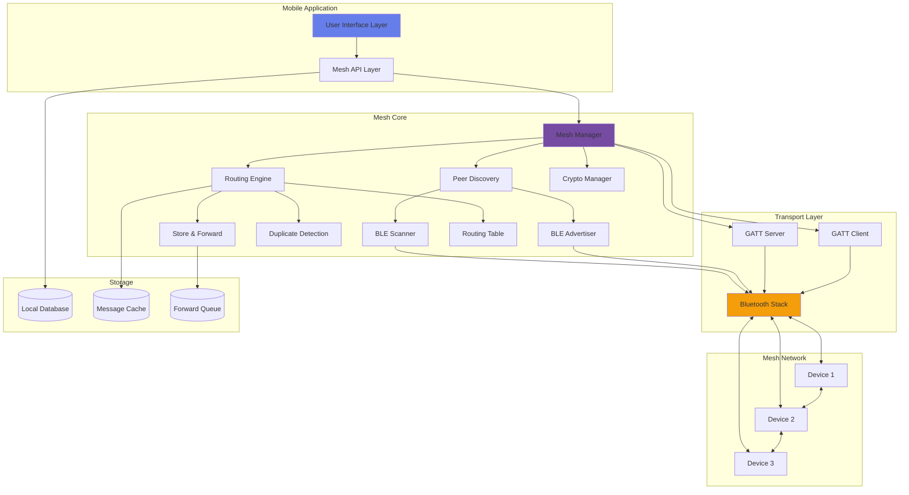
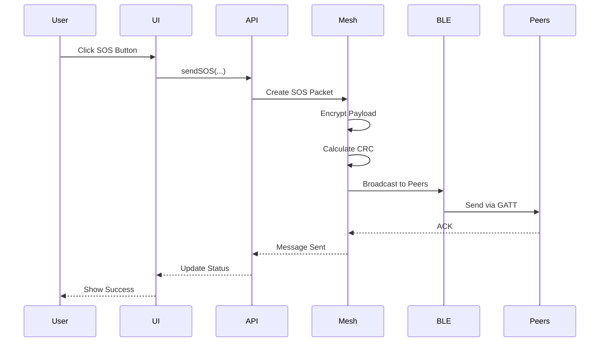
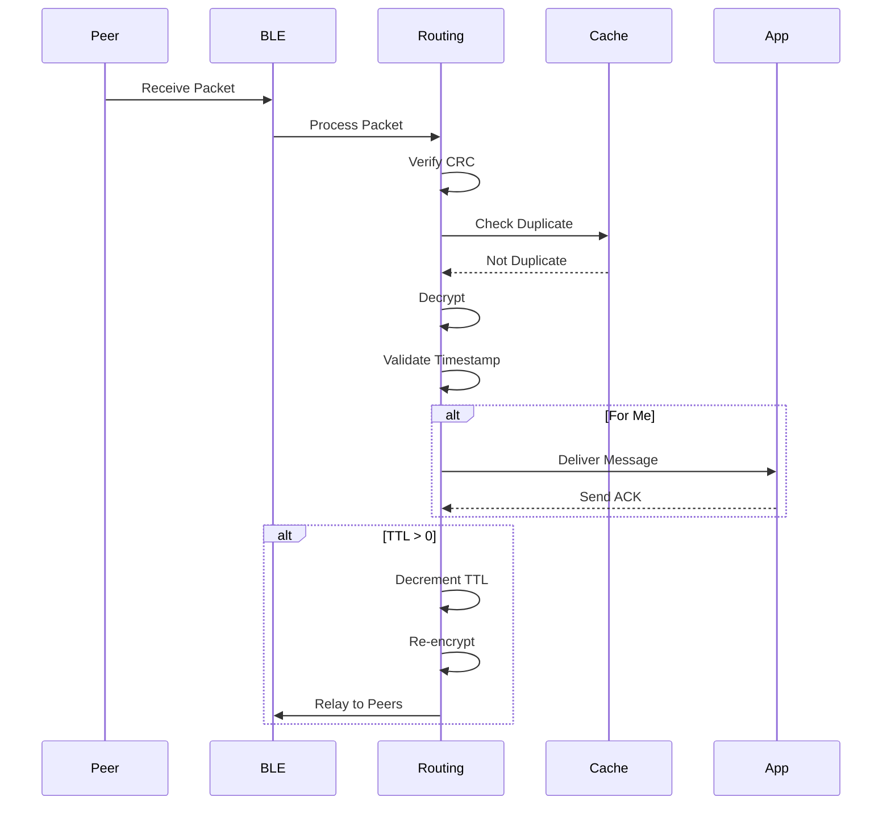

# Bluetooth Mesh Architecture

Complete system architecture for offline disaster communication using Bluetooth mesh networking.

## System Overview



## Architecture Layers

### 1. User Interface Layer

**Responsibility**: Provide user interaction and display mesh status

**Components**:
- **MeshPeerList**: Display nearby devices
- **OfflineChat**: Messaging interface
- **MeshRoutingLog**: Routing visualization
- **SOS Button**: Emergency broadcast

**Technologies**:
- React/React Native for UI
- CSS for styling
- WebSocket for real-time updates

---

### 2. API Layer

**Responsibility**: Abstract mesh functionality with clean JavaScript API

**Components**:
- **MeshAPI Service**: JavaScript wrapper
- **Event Emitter**: Async event handling
- **React Native Bridge**: Native ↔ JS communication

**Key Interfaces**:
```typescript
interface MeshAPI {
  startMesh(): Promise<boolean>
  stopMesh(): Promise<boolean>
  sendSOS(content, location, type): Promise<UUID>
  sendMessage(recipient, content): Promise<UUID>
  getPeers(): Promise<Peer[]>
  on(event, callback): void
}
```

---

### 3. Mesh Core Layer

**Responsibility**: Implement mesh networking logic

#### 3.1 Mesh Manager

**Purpose**: Coordinate all mesh operations

**Functions**:
- Initialize and configure mesh network
- Manage component lifecycle
- Coordinate peer discovery and routing
- Handle message transmission

**Key Methods**:
```kotlin
class MeshNetworkManager {
  fun startMesh()
  fun stopMesh()
  fun sendSOS(...): UUID
  fun sendMessage(...): UUID
  fun getPeers(): List<Peer>
  fun addListener(...)
}
```

#### 3.2 Peer Discovery

**Purpose**: Discover and track nearby mesh nodes

**Mechanism**:
- BLE advertising with custom service UUID
- Continuous BLE scanning
- Neighbor table management
- RSSI-based proximity tracking

**Advertisement Format**:
```
Service UUID: 0000FE50-0000-1000-8000-00805F9B34FB
Data: [DeviceUUID(6) | Status(1) | Version(1)]
```

**Peer Health Monitoring**:
- Track last-seen timestamp
- Remove peers offline > 30 seconds
- Monitor signal strength (RSSI)

#### 3.3 Routing Engine

**Purpose**: Implement multi-hop message routing

**Algorithm**: Controlled Flooding

**Features**:
- Duplicate detection (SHA-256 hash cache)
- TTL management (max 5 hops)
- Store-and-forward for disconnected scenarios
- Automatic relay decision

**Routing Flow**:
```
1. Receive packet → 2. Check CRC
3. Check duplicate → 4. Decrypt
5. Validate timestamp → 6. Check recipient
7. Deliver if for me → 8. Relay if TTL > 0
9. Decrement TTL → 10. Forward to peers
```

#### 3.4 Crypto Manager

**Purpose**: Encrypt/decrypt message payloads

**Algorithm**: AES-128-CBC

**Key Management**:
- Pre-shared network key (16 bytes)
- IV derived from message UUID
- PKCS#7 padding

**Security**:
- End-to-end encryption
- Timestamp validation (±5 min)
- Replay attack prevention

---

### 4. Transport Layer

**Responsibility**: Handle Bluetooth communication

#### 4.1 BLE Scanner

**Purpose**: Discover nearby mesh nodes

**Configuration**:
- Scan mode: BALANCED (battery-efficient)
- Scan interval: 2s active, 10s idle
- Filter: Custom mesh service UUID

#### 4.2 BLE Advertiser

**Purpose**: Announce presence to other nodes

**Configuration**:
- Advertise interval: 1 Hz
- TX power: HIGH (extended range)
- Connectable: Yes

#### 4.3 GATT Server/Client

**Purpose**: Bi-directional message exchange

**GATT Service**:
- Service UUID: `0000FE50-0000-1000-8000-00805F9B34FB`
- Characteristic UUID: `0000FE51-0000-1000-8000-00805F9B34FB`
- Properties: READ | WRITE | NOTIFY

**Connection Management**:
- Max 7 simultaneous connections (BLE limit)
- Priority queue for message transmission
- Automatic reconnection on failure

---

### 5. Storage Layer

**Responsibility**: Persist mesh data locally

#### 5.1 Local Database (SQLite)

**Tables**:
- `mesh_messages`: Stored messages
- `mesh_peers`: Known peers
- `mesh_routing_cache`: Duplicate detection

**Schema**: See [mesh_schema.sql](../database/mesh_schema.sql)

#### 5.2 Message Cache

**Purpose**: Duplicate detection

**Implementation**: LRU cache (500 entries)
**TTL**: 5 minutes
**Key**: SHA-256(MessageUUID + SenderUUID)

#### 5.3 Forward Queue

**Purpose**: Store-and-forward for offline peers

**Retry Strategy**:
- Interval: 30 seconds
- Max retries: 20 (10 minutes)
- Expiration: 1 hour

---

## Message Flow

### Sending SOS Broadcast



### Receiving and Relaying Message



---

## Network Topology

### Linear Chain (Worst Case)

```
A ←→ B ←→ C ←→ D ←→ E

TTL=5 allows message from A to reach E
```

### Mesh Network (Best Case)

```
    A ←→ B
    ↕    ↕
    C ←→ D ←→ E
         ↕
         F

Multiple paths increase reliability
```

### Hybrid (Realistic)

```
      A
     ↙ ↘
    B   C ←→ D
    ↓       ↓
    E ←→ F ←→ G

Combines chains and mesh
```

---

## Performance Characteristics

### Latency

| Hops | Latency (avg) | Latency (max) |
|------|---------------|---------------|
| 1    | 50 ms         | 200 ms        |
| 2    | 100 ms        | 400 ms        |
| 3    | 150 ms        | 600 ms        |
| 4    | 200 ms        | 800 ms        |
| 5    | 250 ms        | 1000 ms       |

### Throughput

- **Per Connection**: ~10 KB/s
- **Max Concurrent**: 7 connections (BLE limit)
- **Messages/Second**: 5-10 (depending on payload)

### Coverage

- **Direct Range**: 10-50 meters (environment-dependent)
- **Multi-Hop Range**: 50-250 meters (5 hops)
- **Max Devices**: 50+ (theoretically unlimited)

### Battery Impact

| Mode | Power Draw | Daily Impact |
|------|------------|--------------|
| Continuous Scan | ~5 mA | 15-20% |
| Balanced Scan | ~2 mA | 8-12% |
| Low Power Scan | ~1 mA | 3-5% |
| Idle | ~0.5 mA | <1% |

---

## Scalability

### Device Limit

**Theoretical**: Unlimited (flooding propagates to all)
**Practical**: 50-100 devices (duplicate detection limits)

### Message Load

**Recommended**: <100 messages/minute
**Max Burst**: 500 messages/minute (with congestion)

### Network Density

**Optimal**: 3-7 nearby peers per device
**Max**: 20+ peers (BLE connection limit applies)

---

## Fault Tolerance

### Node Failure

- **Detection**: 30-second timeout
- **Recovery**: Automatic route around failed node
- **Impact**: Minimal (mesh self-heals)

### Network Partition

- **Detection**: No peers in range
- **Handling**: Store-and-forward queue
- **Recovery**: Automatic when partition heals

### Message Loss

- **Cause**: High interference, network congestion
- **Mitigation**: Duplicate broadcasts, ACK mechanism
- **Recovery**: Retry up to 20 times

---

## Security Architecture

### Encryption

```
Plaintext → JSON → AES-128-CBC → Ciphertext
                   ↑
                   Key: Pre-shared (16 bytes)
                   IV: Message UUID (16 bytes)
```

### Attack Mitigation

| Attack Type | Mitigation Strategy |
|-------------|---------------------|
| Replay | Timestamp validation + duplicate detection |
| MITM | End-to-end encryption |
| Eavesdropping | AES-128 encryption |
| DoS (Flooding) | Rate limiting (10 msg/sec per peer) |
| Sybil | Device UUID tracking |

---

## Future Enhancements

1. **Adaptive Routing**: Distance-based next-hop selection
2. **Compression**: LZ4 for large payloads
3. **Fragmentation**: Support messages > 512 bytes
4. **QoS**: Priority queuing for critical messages
5. **Topology Mapping**: Distributed routing table
6. **Cross-platform**: iOS support (limited background mode)

---

## Implementation Notes

### Android Limitations

- **BLE Connections**: Max 7 simultaneous
- **Background**: Requires foreground service
- **Battery**: Continuous scanning drains battery

### iOS Limitations

- **Background BLE**: Severely restricted
- **Advertising**: Limited to 28 bytes
- **Scanning**: Delayed when app backgrounded

### Solutions

- **Foreground Service**: Keep mesh active in background (Android)
- **Wake Lock**: Prevent sleep during critical operations
- **Adaptive Scanning**: Reduce frequency when battery low
- **Peer Prioritization**: Connect to strongest signals first

---

## References

- Bluetooth Core Specification v5.4
- IETF RFC 3561 (AODV Routing Protocol)
- Android BLE Guide: https://developer.android.com/guide/topics/connectivity/bluetooth-le
- Delay-Tolerant Networking: RFC 4838
