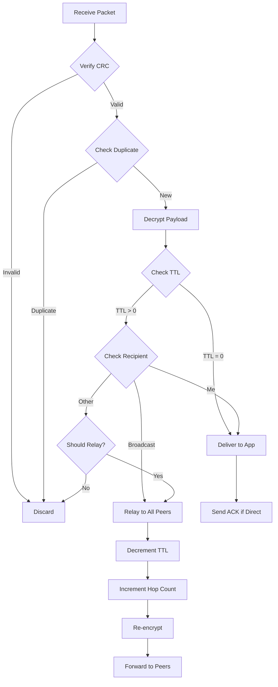

# Bluetooth Mesh Protocol Specification

**Version**: 1.0  
**Last Updated**: 2025-11-27

## Overview

This document defines the Bluetooth Mesh Protocol for offline disaster communication. The protocol enables multi-hop message routing across Bluetooth-enabled devices without internet connectivity.

## Protocol Characteristics

- **Transport**: Bluetooth Low Energy (BLE) 4.0+
- **Topology**: Ad-hoc mesh network
- **Routing**: Flooding-based with TTL
- **Encryption**: AES-128-CBC
- **Max Hops**: 5 (configurable)
- **Max Devices**: 50+ (theoretically unlimited with proper TTL)

---

## Packet Format

### Binary Packet Structure

Total packet size: **Variable (64-512 bytes)**

```
┌──────────────────────────────────────────────────────────────┐
│                      MESH PACKET FORMAT                       │
├─────────┬────────┬──────────────────────────────────────────┤
│ HEADER  │  CRC   │          ENCRYPTED PAYLOAD                │
│ 32 bytes│ 2 bytes│          Variable (30-478 bytes)          │
└─────────┴────────┴──────────────────────────────────────────┘
```

### Header Format (32 bytes)

| Offset | Size | Field | Description |
|--------|------|-------|-------------|
| 0 | 1 byte | Protocol Version | Current: 0x01 |
| 1 | 1 byte | Message Type | SOS=0x01, DIRECT=0x02, RELAY=0x03, ACK=0x04 |
| 2 | 16 bytes | Message UUID | Unique message identifier (UUID v4) |
| 18 | 1 byte | Hop Count | Current hop count (0-255) |
| 19 | 1 byte | TTL | Time to live / max hops (default: 5) |
| 20 | 4 bytes | Timestamp | Unix timestamp (seconds since epoch) |
| 24 | 6 bytes | Sender UUID | Device identifier (truncated UUID or MAC) |
| 30 | 2 bytes | Payload Length | Length of encrypted payload |

### CRC Checksum (2 bytes)

- **Algorithm**: CRC-16-CCITT
- **Polynomial**: 0x1021
- **Initial Value**: 0xFFFF
- **Computed Over**: Header + Payload

### Encrypted Payload (Variable)

Encrypted using AES-128-CBC with the following structure:

**Before Encryption:**
```json
{
  "type": "SOS|DIRECT|RELAY|ACK",
  "sender": "device-uuid",
  "recipient": "device-uuid or broadcast",
  "content": "message text",
  "location": {
    "lat": 0.0,
    "lng": 0.0
  },
  "priority": 1-5,
  "timestamp": 1234567890
}
```

**Encryption Details:**
- **Algorithm**: AES-128-CBC
- **Key**: Derived from pre-shared network key (PSK)
- **IV**: First 16 bytes of Message UUID
- **Padding**: PKCS#7

---

## Message Types

### 1. SOS Broadcast (Type 0x01)

Emergency broadcast to all devices in mesh.

**Characteristics:**
- **Recipient**: Broadcast (all devices)
- **Priority**: Maximum (5)
- **TTL**: 5 hops
- **Relay**: Mandatory by all nodes

**Payload Example:**
```json
{
  "type": "SOS",
  "sender": "device-abc123",
  "recipient": "broadcast",
  "content": "Medical emergency - need immediate assistance",
  "location": {
    "lat": 28.6139,
    "lng": 77.2090
  },
  "priority": 5,
  "timestamp": 1732725692,
  "sosType": "MEDICAL|FIRE|FLOOD|EARTHQUAKE"
}
```

### 2. Direct Message (Type 0x02)

One-to-one message to specific device.

**Characteristics:**
- **Recipient**: Specific device UUID
- **Priority**: Normal (3)
- **TTL**: 5 hops
- **Relay**: Only if recipient matches or TTL > 0

**Payload Example:**
```json
{
  "type": "DIRECT",
  "sender": "device-abc123",
  "recipient": "device-xyz789",
  "content": "Are you safe? Reply if you can hear this.",
  "priority": 3,
  "timestamp": 1732725692
}
```

### 3. Relay Packet (Type 0x03)

Forwarded packet in multi-hop routing.

**Characteristics:**
- **Recipient**: Varies (copied from original)
- **Priority**: Preserved from original
- **TTL**: Decremented by 1
- **Hop Count**: Incremented by 1

**Processing:**
1. Receive packet
2. Check duplicate (hash cache)
3. Decrypt and verify
4. If TTL > 0, decrement TTL, increment hop count
5. Re-encrypt and forward

### 4. ACK (Type 0x04)

Delivery confirmation.

**Characteristics:**
- **Recipient**: Original sender
- **Priority**: Low (2)
- **TTL**: 5 hops
- **Payload**: Original message UUID

**Payload Example:**
```json
{
  "type": "ACK",
  "sender": "device-xyz789",
  "recipient": "device-abc123",
  "originalMessageId": "550e8400-e29b-41d4-a716-446655440000",
  "timestamp": 1732725700
}
```

---

## BLE Advertisement Format

For peer discovery, devices advertise using BLE advertisements.

### Service UUID

**Custom Service UUID**: `0000FE50-0000-1000-8000-00805F9B34FB`

### Advertisement Data

| Offset | Size | Field | Description |
|--------|------|-------|-------------|
| 0 | 2 bytes | Flags | 0x06 (General Discoverable, BR/EDR Not Supported) |
| 2 | 16 bytes | Service UUID | Mesh service identifier |
| 18 | 6 bytes | Device UUID | Truncated device identifier |
| 24 | 1 byte | Node Status | 0x01=Active, 0x02=LowBattery, 0x03=HighLoad |
| 25 | 1 byte | Mesh Version | Protocol version |

### Scan Response Data

Contains device name and capabilities:
```
Mesh-Node-ABC123 | Hops:5 | Battery:85%
```

---

## Routing Algorithm: Controlled Flooding

### Principles

1. **Broadcast Propagation**: All nodes relay SOS messages
2. **Duplicate Detection**: Hash-based cache to prevent loops
3. **TTL Management**: Prevents infinite propagation
4. **Store-and-Forward**: Queue messages when no peers available

### Algorithm Steps



### Duplicate Detection

**Hash Function**: SHA-256 of (Message UUID + Sender UUID)

**Cache**:
- **Type**: LRU Cache
- **Size**: 500 entries
- **TTL**: 5 minutes

**Logic**:
```python
def is_duplicate(message_uuid, sender_uuid):
    hash_key = sha256(message_uuid + sender_uuid)
    if hash_key in duplicate_cache:
        return True
    duplicate_cache[hash_key] = current_time()
    return False
```

### Store-and-Forward

When no peers are available:

1. **Queue Message**: Store in local database
2. **Retry Logic**: Attempt forwarding every 30 seconds
3. **Max Retries**: 20 attempts (10 minutes)
4. **Expiration**: Discard after 1 hour

---

## Security & Encryption

### Network Key

- **Pre-Shared Key (PSK)**: 128-bit key distributed during app installation
- **Key Rotation**: Manual (can be updated via app settings)
- **Default Key**: Derived from app signature + salt

### Message Encryption

**Process**:
1. Serialize payload to JSON
2. Generate IV from Message UUID (first 16 bytes)
3. Encrypt using AES-128-CBC
4. Append PKCS#7 padding

**Decryption**:
1. Extract IV from Message UUID
2. Decrypt using AES-128-CBC
3. Remove padding
4. Parse JSON

### Attack Mitigation

| Attack | Mitigation |
|--------|-----------|
| Replay Attack | Timestamp validation (±5 min window) + duplicate detection |
| Man-in-the-Middle | AES encryption + pre-shared key |
| DoS (Flooding) | Rate limiting (max 10 msg/sec per peer) |
| Eavesdropping | End-to-end encryption |

---

## Performance Characteristics

### Latency

- **Single Hop**: 50-200 ms
- **3 Hops**: 150-600 ms
- **5 Hops**: 250-1000 ms

### Throughput

- **Per Connection**: ~10 KB/s
- **Max Concurrent Connections**: 7 (BLE limitation)
- **Messages/Second**: ~5-10 (depending on payload size)

### Battery Consumption

| Mode | Power Draw | Impact |
|------|------------|--------|
| BLE Scanning (Continuous) | ~5 mA | High |
| BLE Advertising (1 Hz) | ~1 mA | Low |
| GATT Connection | ~10 mA | High |
| Idle (Background Service) | ~0.5 mA | Minimal |

**Optimization**: Adaptive scan intervals (2s active, 10s idle)

---

## Error Handling

### CRC Mismatch
- **Action**: Discard packet silently
- **Logging**: Increment error counter

### Decryption Failure
- **Action**: Discard packet
- **Possible Cause**: Wrong network key or corrupted data

### TTL Expiration
- **Action**: Do not relay
- **Delivery**: If recipient matches, deliver to app

### Peer Disconnection
- **Action**: Move to store-and-forward queue
- **Retry**: Next available peer

---

## Compatibility

### Minimum Requirements

- **Android**: API Level 21 (Android 5.0+)
- **Bluetooth**: BLE 4.0+
- **Python**: 3.7+ with PyBluez

### Known Limitations

1. **BLE Connections**: Max 7 simultaneous (Android limitation)
2. **iOS Compatibility**: Limited (background BLE restrictions)
3. **Range**: ~10-50 meters (depends on environment)
4. **Packet Size**: Max 512 bytes (BLE MTU limitation)

---

## Future Enhancements

1. **Adaptive Routing**: Distance-based next-hop selection
2. **Compression**: LZ4 payload compression for larger messages
3. **Fragmentation**: Support for messages > 512 bytes
4. **QoS Levels**: Priority queuing for critical messages
5. **Mesh Topology Map**: Distributed routing table

---

## References

- Bluetooth Core Specification v5.4
- IETF RFC 3561 (AODV Routing)
- Delay-Tolerant Networking Architecture (RFC 4838)
